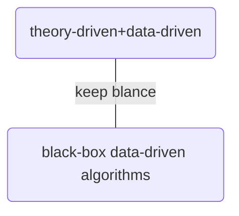

# A Review of Reinforcement Learning for Instructional Sequencing 总结

## Abstract

强化学习为优化给定学生模型的Instructional Sequencing提供了一个天然的框架，已经活跃了大约15年。但是强化学习是否真的能帮助学生学习呢？文章为了探究这个问题，对过去使用强化学习进行教学指导序列的各种尝试进行了回顾。

<!--more-->

## Introduction

简单介绍了研究的起源和历史，以及文章讨论的问题

- 1960 Ronald Howard(“father of decision analysis.”)：

  - Dynamic Programming and Markov Decision Processes : RL的基石
  - Machine-Aided Learning. ： 一篇鲜为人知的文章，指出可以使用计算机辅助制定个性化的教学顺序

- 1962 Richard Smallwood(Ronald Howard的博士学生)
  - A Decision Structure for Teaching Machines ：how to use decision processes to adapt instruction in a computerized teaching machine. This is perhaps the first example of using reinforcement learning (broadly conceived) for the purposes of instructional sequencing.

- We find that reinforcement learning has been most successful in cases where it has been constrained with ideas and theories from cognitive psychology and the learning sciences.
- However,given that our theories and models are limited, we also find that it has been useful to complement this approach with **running more robust offline analyses  that do not rely heavily on the assumptions of one particular model**.

## Reinforcement Learning: Towards a “Theory of Instruction”

- MDP
  - $S$ is a set of states
  - $A$ is a set of actions
  - $T$ is a transition function where $T(s^\prime|s, a)$ denotes the probability of transitioning from state s to state $s^\prime$ after taking action $a$
  - $R$ is a reward function where $R(s, a)$ specifies the reward (or the probability distribution over rewards) when action a is taken in state $s$
  - $H$ is the horizon, or the number of time steps where actions are taken.
  
  In the context of instruction:
  - states are the states that hte student can be in (such as cognitive states)
  - The set of acitions are instructional activities that can change the student's cognitive state.(such as **problems, problem steps, flashcards, videos, worked examples, game levels in the context of an educational game**)

**we focus on studies where the actions are instructional activities
taken by an RL agent to optimize a student’s learning over the course of many activities.**
文中涉及的actions是由RL agent做出的，用来帮助学生学习的（如agent为学生推荐题目），而不是学生做出的（另一类问题，文中不关注）。

- OPMDP & BKT

- task-loop 
- step-loop

## A Historical Perspective

## Review of Empirical Studies

### 论文\研究入选标准：

- The study acknowledges (at least implicitly) that there is a model governing student learning and giving different instructional actions to a student might probabilistically change the state of a student according to the model.

- There is an instructional policy that maps past observations from a student (e.g., responses to questions) to instructional actions.
  
- Data collected from students (e.g., correct or incorrect responses to previous questions), either in thepast (offline) or over the course of the study (online), are used to learn either:
  
  - a statistical model of student learning, and/or
  - an instructional policy

- If a statistical model of student learning is fit to data, the instructional policy is designed to approximately optimize that model according to some reward function, which may be implicitly specified.

### 结果

#### 在符合标准的34篇论文（包括41个研究）中：

- 19篇使用离线数据，但没有在真实学生上进行评估
- 至少有23篇，只使用了模拟数据
- 只少8篇仅提议使用强化学习进行Instructional Sequencing (At least eight papers simply proposed using RL for instructional sequencing or proposed an algorithm for doing so in a particular setting without using simulated or real data.)

#### 在其它相关研究中：

- 至少有14篇在真实学生身上进行，但是研究不符合上述标准，如：
  -  没有实验
  -  使用人工设置的模型参数，而不是从数据中学习的参数
  -  varying more than just the instructional policy across conditions

#### RL策略与Baseline策略对比：

|                                   | Sig | ATI | Mixed | Not Sig | Sig Worse |
|-----------------------------------|-----|-----|-------|---------|-----------|
| Paired\-Associate Learning Tasks  | 11  | 0   | 0     | 2       | 1         |
| Paired\-Associate Learning Tasks  | 11  | 0   | 0     | 2       | 1         |
| Concept Learning Tasks            | 4   | 0   | 2     | 1       | 0         |
| Sequencing Interdependent Content | 0   | 0   | 2     | 6       | 0         |
| Sequencing Activity Types         | 4   | 4   | 0     | 2       | 0         |
| Not Optimizing Learning           | 2   | 0   | 0     | 0       | 0         |

- Sig indicates that at least one RL-induced policy significantly outperformed all baseline policies
- ATI indicates an aptitude-treatment interaction
- Mixed indicates the RL-induced policy significantly outperformed some but not all baselines
- Not sig indicates that there were no significant differences between policies, Sig worse indicates that the RL-induced policy was significantly worse than the baseline policy (which for the only such case was an adaptive policy).

#### 5类研究：

- Paired-Associate Learning Tasks
- Concept Learning Tasks
- **Sequencing Interdependent Content**
- Sequencing Activity Types
- Not Optimizing Learning：目标不是学生的能力增长和学习速度

