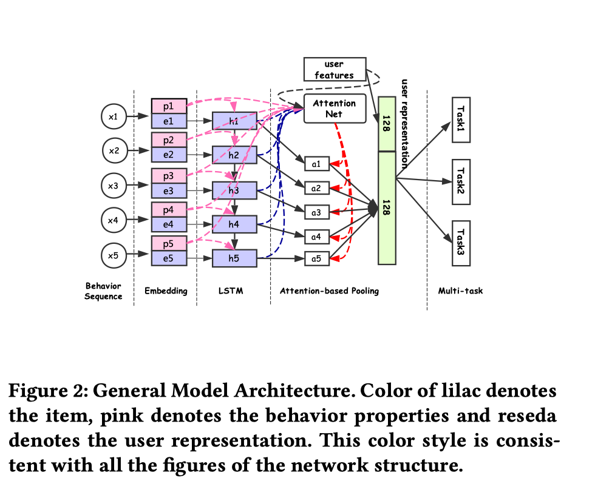
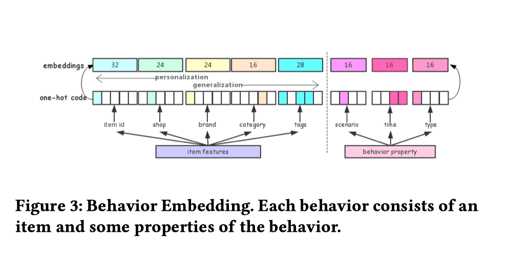
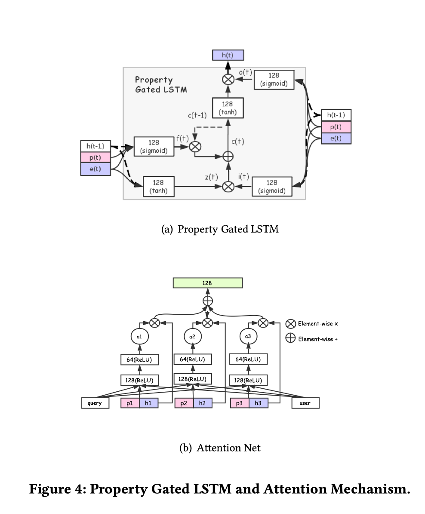
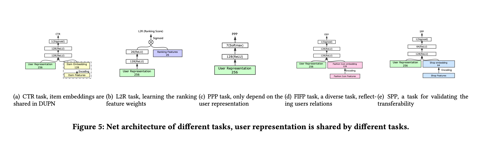
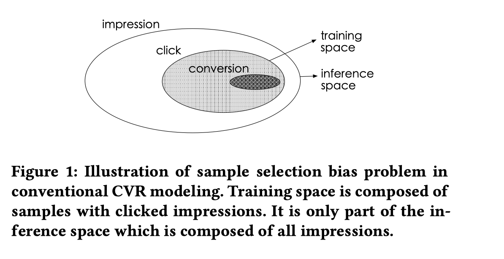
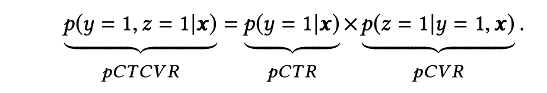
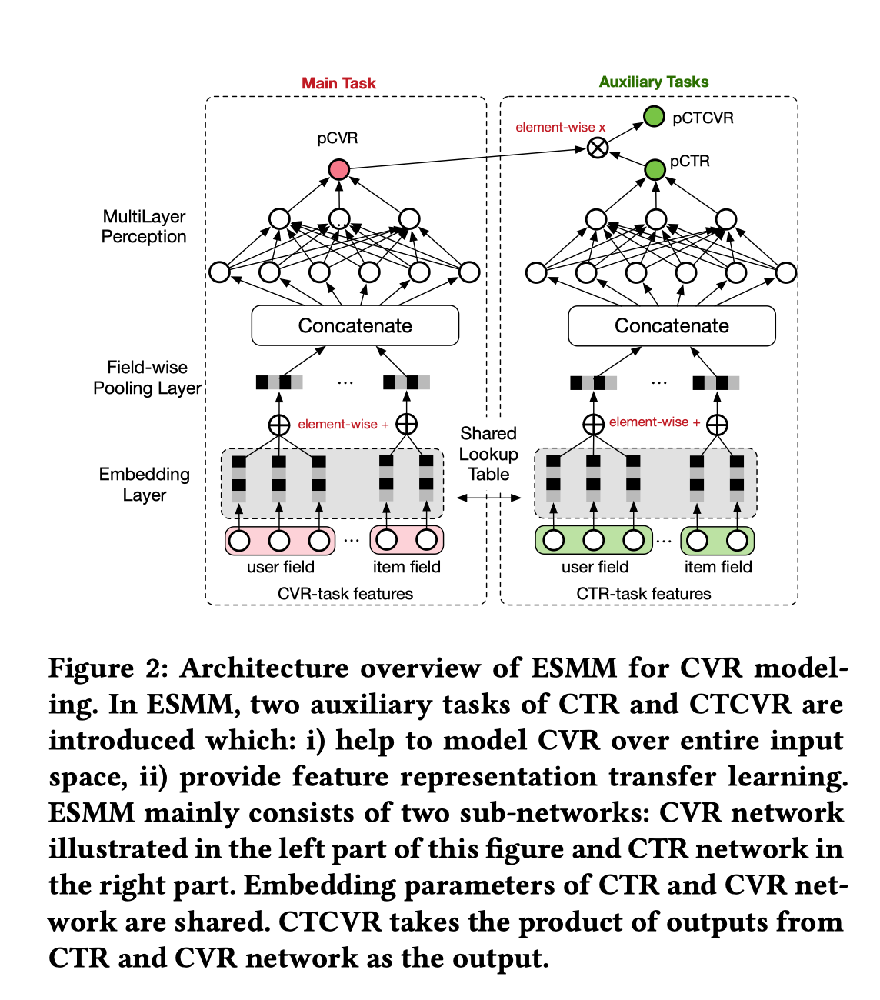

之前分享了来自Google的经典多任务模型MMoE，本篇对来自阿里的两篇多任务模型进行概述。

<!-- more  -->

## 1. DUPN

Deep User Perception Network (DUPN) 是一个用于用户特征表示的网络，将用户的行为序列表示为用户特征，服务于下游的多任务（文章中是淘宝搜索场景下进行5个任务）

### 1.1 DUPN部分

模型现将用户行为序列进行embedding，每个时刻的embedding包括两部分，p：the behavior properties ， e：the user representation. 这两部分在后续是分开用的。 然后是lstm和attention，lstm多输入的embedding做了分开的处理。

- 行为序列embedding
  

  每个行为序列可以表示成e $\{x_1 ,x_2 , . . . ,x _N\}$, 其中$x_i = <item_i,property_i>$,$item_i$就是图中紫色的部分，包括商品id和一些其他信息，$property_i$就是图中粉色的部分，包括场景时间行为类型等信息。 和整体结构图中的两部分embedding颜色上也是对应的。
- Property Gated LSTM & Attention Net

  LSTM这里需要注意的就是p(t)和e(t)这两部分embedding是分开的

  Attention这里 query就是搜索的query的user是上边的e(t)concat起来，然后算出每个h的权重， 可以结合整体架构去看。 黑色线是用户embedding的数据流，粉线是行为property embedding的数据流

### 1.2 下游任务部分

- CTR
- L2R ：point-wise L2R
- Price Preference Prediction(PPP) 预测用户的购买价格区间
- Fashion Icon Following Prediction(FIFP) 预测用户关注的Fashion Icon
- Shop Preference Prediction (SPP) 预测购物偏好， 这部分不是和上述4个任务一起训练的，而是上述四个任务训练好的DUPN迁移到这个任务来用。
  

## 2. ESMM

ESMM是为了解决pCVR预估训练样本选择bias的问题。 训练样本选择的是曝光且点击的样本，然而预测的时候样本是来自曝光空间的。

pCTR,pCVR,pCTCVR满足下面的关系，x是样本，y是点击事件，z是转化事件。

于此便有了模型的架构，模型分别使用2个辅助任务，预测pCTR和pCTCVR，任务共享Embedding层。
pCTCVR由 两部分相乘得到，并且计算loss的时候计算pCTCVR和pCTR的loss

### 参考文献

[1] Yabo Ni ∗ , Dan Ou ∗ , Shichen Liu, Xiang Li, Wenwu Ou, Anxiang Zeng, Luo Si. 2018. Perceive Your Users in Depth: Learning Universal User Representa- tions from Multiple E-commerce Tasks. In KDD ’18: The 24th ACM SIGKDD International Conference on Knowledge Discovery & Data Mining, August 19–23, 2018, London, United Kingdom. ACM, New York, NY, USA, 10 pages. https://doi.org/10.1145/3219819.3219828

[2] Xiao Ma, Liqin Zhao, Guan Huang, Zhi Wang, Zelin Hu, Xiaoqiang Zhu, Kun Gai. 2018. Entire Space Multi-Task Model: An Effective Approach for Estimating Post-Click Conversion Rate. In SIGIR ’18: The 41st International ACM SIGIR Conference on Research and Development in Information Retrieval, July 8–12, 2018, Ann Arbor, MI, USA. ACM, New York, NY, USA, 4 pages. https://doi.org/10.1145/3209978.3210104