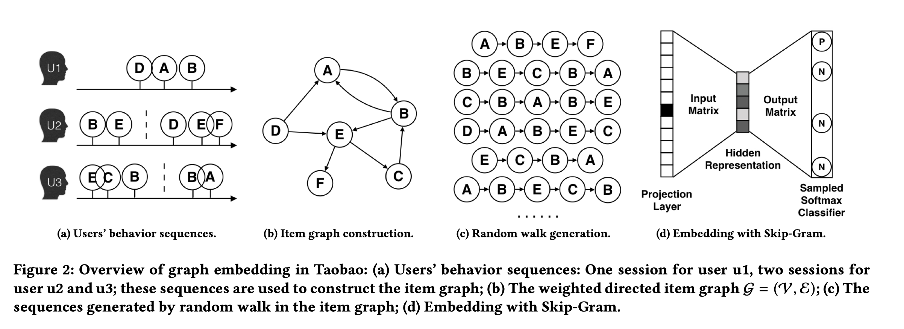
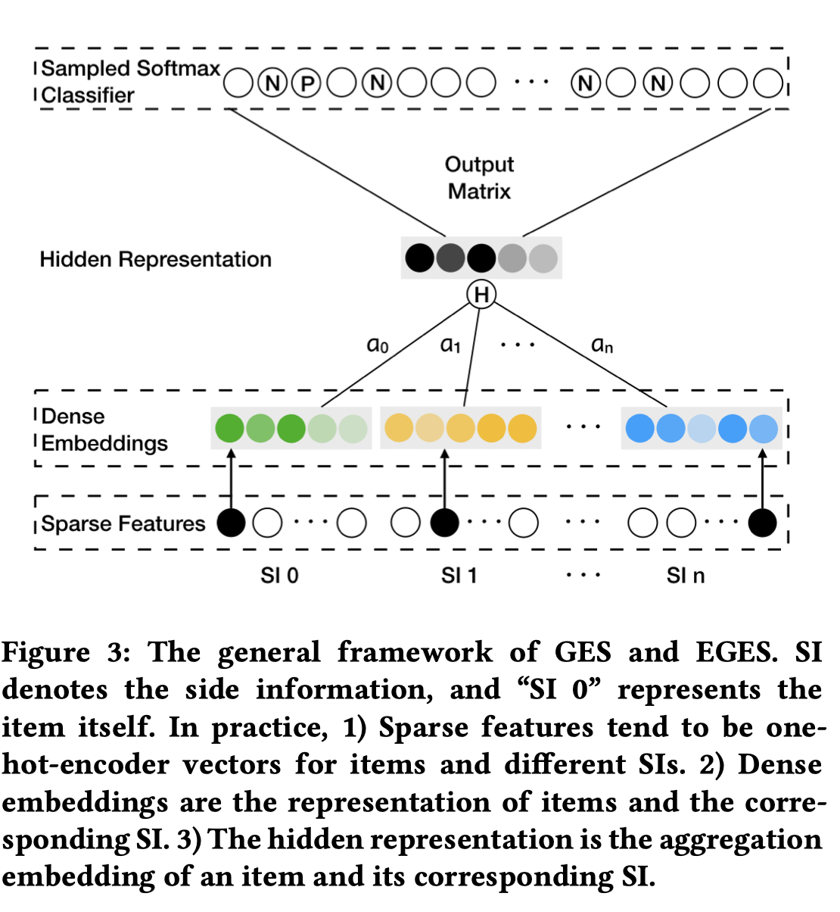

又到周末了，这次来回顾两个又是来自阿里的召回算法：EGES和MIND
<!-- more -->

## 1. EGES

Enhanced Graph Embedding with Side information(EGES)，一种引入了物品side-info的图嵌入方法，用来表示item embedding，进而进行i2i召回。

- CF-based 仅考虑item在用户行为的共现，EGES使用Graph Embedding 可以考虑到更高阶的相似性
- 引入了item的Side-informat，解决item冷启的问题

### 1.1 构建图
- 用户行为序列（time(1h) window内的 called session-based users’ behaviors.）
- 用户行为序列构建item关系图,边的权重就是出现次数，并进行过滤和去噪。
    - unintentional click
    - spam user ("over action")
    - 频繁更新的商品

### 1.2 Base Graph Embedding
- 从图中生成序列
- 用生成的序列进行item embedding

### 1.3 Graph Embedding with Side Information

将原来item的embedding和各个side info的embedding 做avg pooling 得到item的 embedding

### 1.4 Enhanced Graph Embedding with Side Information

将avg pooling 改成了加权平均， 因为不同的物品，不同side info的贡献不同，类似intension机制。 使用一个权重矩阵$A \in R^{|V|*(n+1)}$来表示每个物品的side info的权重,$a_{ij}$就是第i个物品的j个side info的权重(需要softmax一下)。