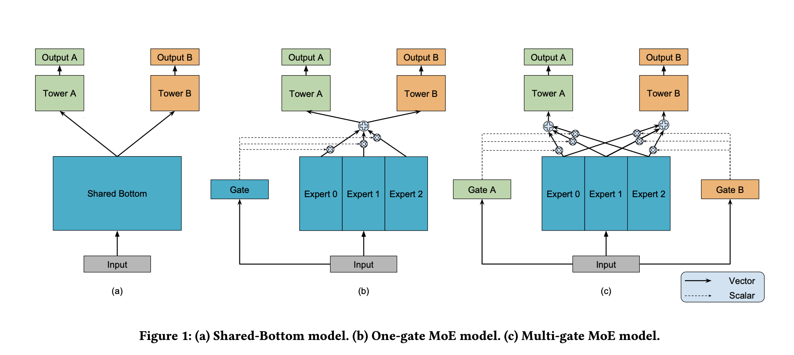

Multi-gate Mixture-of-Experts(MMoE)是google2018年提出的一种多任务学习的模型<https://dl.acm.org/doi/pdf/10.1145/3219819.3220007>。本文对模型进行简单的解析和实现(使用tf2.0)。

TODO： 论文中的人造数据实验/模型的应用

<!-- more -->

## 1.模型简述

和其大部分多任务模型一样，MMoE模型的任务共享一部分网络，但又通过Gate产生权重来控制每个任务获取多个共享的Expert网络输出。下图来自论文原文，展示模型的演进过程。



(a)表示最基础的共享底层网络的多任务模型，共享网络的输出作为多个任务独立网络(Tower A，Tower B)的输入，这种模型的缺点显而易见，**模型无法根据任务和输入的不同自适应的调整共享网络的输出**。

(b)表示只有一个Gate的模型即MoE模型，该模型加入了一个多个任务共享的Gate， 并且将底层共享的网络进行了拆分，多个Exper可以学到对输入的不同表示。这个Gate的输入由输入控制，因此模型可以根据输入的不同自适应的调整每个Exper的组合权重(感觉有点儿类似attention机制，key是输入，query和value是Expert的输出)。由于是多个任务共享同一个Gate，**因此该模型无法根据任务的不同调整各个Expert的组合权重**。

(c)就是本文的主角MMoE模型了，可以看到MMoE为每个任务都设置了一个Gate，这样模型就可以根据输入和任务的不同来确定Expert输出的组合权重了。

## 2.模型实现

### Gate

Gate的计算很简单，输入经过一个线性层再softmax，即产生每个gate的权重。这里直接上代码。数学上来讲就是输入x（1\*input_size）乘以一个input_size\*nums_expert的矩阵，再对输出进行softmax。

``` python
class Gate(tf.keras.layers.Layer):
    def __init__(self, num_experts, task_index):
        super(Gate, self).__init__()
        self.dense = tf.keras.layers.Dense(num_experts, name='gate_weights_for_task{}'.format(task_index))
        self.softmax = tf.keras.layers.Softmax()

    def call(self, inputs):
        x = self.dense(inputs)
        x = self.softmax(x)
        return x  ## weight of each expert of task i
```

### Expert

Expert就是一个DNN网络，学要根据实际的任务进行设计，这里使用一个3个hidden_layer的全连接网络作为demo。

``` python
class Expert(tf.keras.layers.Layer):
    def __init__(self, expert_index):
        super(Expert, self).__init__()
        self.dense1 = tf.keras.layers.Dense(256, activation='relu', name='expert_{}_fc1'.format(expert_index))
        self.dense2 = tf.keras.layers.Dense(128, activation='relu', name='expert_{}_fc2'.format(expert_index))
        self.dense3 = tf.keras.layers.Dense(64, activation='relu', name='expert_{}_fc3'.format(expert_index))

    def call(self, inputs):
        x = self.dense1(inputs)
        x = self.dense2(x)
        x = self.dense3(x)
        return x  # outputs of expert i
```

### Tower(每个任务独立的网络部分)
这部分可以根据任务的不同为每个任务单独设计，这里用一个简单的结构作为demo
``` python
class Tower(tf.keras.layers.Layer):
    def __init__(self, task_index):
        super(Tower, self).__init__()
        self.dense = tf.keras.layers.Dense(1)

    def call(self, inputs):
        x = self.dense(inputs)
        return x
```

### MMoE Model
这里再初始化的时候分别初始化gates，experts和towers.
**这里实现有些问题， 每个expert的结果原文中是加权后concat，这里是加权sum**
``` python
class MMoE(tf.keras.Model):

    def __init__(self, nums_expert, nums_task):
        super(MMoE, self).__init__()

        self.nums_expert = nums_expert
        self.nums_task = nums_task

        # experts
        self.experts = [Expert(expert_index) for expert_index in range(self.nums_expert)]

        # gates
        self.gates = [Gate(self.nums_expert, task_index) for task_index in range(self.nums_task)]
        
        self.towers = [Tower(task_index) for task_index in range(self.nums_task)]

    def call(self, inputs):

        # 错误的实现方式， 遮掩会导致第0维不是batch，而是 expert_index  gate同理
        #         experts_out = tf.Variable([self.experts[i](inputs) for i in range(self.nums_expert)])
        #         gates_out = tf.Variable([self.gates[i](inputs) for i in range(self.nums_task)])


        # 这里为了保证batch第0维， 先将batch是第1维的输出按batch拼接再reshape， 具体变可以自己写个demo试一下，片尾会给出。
        experts_out = tf.concat([self.experts[i](inputs) for i in range(self.nums_expert)], 1)
        experts_out = tf.reshape(experts_out, (-1, self.nums_expert, 64))
        gates_out = tf.concat([self.gates[i](inputs) for i in range(self.nums_task)], 1)
        gates_out = tf.reshape(gates_out, (-1, self.nums_task, self.nums_expert))
        ## calculate input of towers

        # 这里最好把矩阵画出来乘以下方便理解（直接画不考虑batch的，这里已经是batch_first）
        towers_input = tf.matmul(gates_out, experts_out, 0)

        # 这里同理，对numtask遍历又会变成第0维不是batch
        out = tf.concat([self.towers[i](towers_input[:, i]) for i in range(self.nums_task)], 1)
        out = tf.reshape(out, (-1, self.nums_task, 1))

        return out
```

``` python

## (task,batch,dim)
t1 = tf.Variable([
    tf.Variable([[1,2,3],[4,5,6],[7,8,9]]),
    tf.Variable([[1,2,3],[4,5,6],[7,8,9]])
])

<tf.Variable 'Variable:0' shape=(2, 3, 3) dtype=int32, numpy=
array([[[1, 2, 3],
        [4, 5, 6],
        [7, 8, 9]],

       [[1, 2, 3],
        [4, 5, 6],
        [7, 8, 9]]], dtype=int32)>

#获取第一个batch
t1[:,1]
<tf.Tensor: id=1473, shape=(2, 3), dtype=int32, numpy=
array([[4, 5, 6],
       [4, 5, 6]], dtype=int32)>

# 先按batch拼接
t1 = tf.concat([
    tf.Variable([[1,2,3],[4,5,6],[7,8,9]]),
    tf.Variable([[1,2,3],[4,5,6],[7,8,9]])
],1)
t1

<tf.Tensor: id=1646, shape=(3, 6), dtype=int32, numpy=
array([[1, 2, 3, 1, 2, 3],
       [4, 5, 6, 4, 5, 6],
       [7, 8, 9, 7, 8, 9]], dtype=int32)>

#reshape成batch first
tf.reshape(t1,(-1,2,3))
<tf.Tensor: id=1684, shape=(3, 2, 3), dtype=int32, numpy=
array([[[1, 2, 3],
        [1, 2, 3]],

       [[4, 5, 6],
        [4, 5, 6]],

       [[7, 8, 9],
        [7, 8, 9]]], dtype=int32)>
```