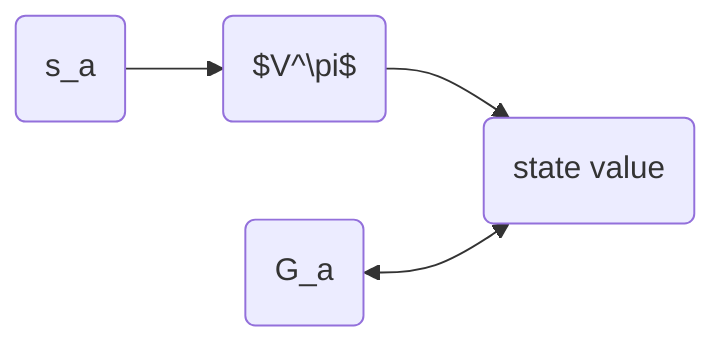

# 深度强化学习笔记

- Key Papers in Deep RL <https://spinningup.openai.com/en/latest/spinningup/keypapers.html#>
  
<!-- more -->

## 1. 基于值函数（Value Function）的方法
在这类方法中，训练的是Value Funciont,或者称作Critic，Critic不直接采取行为，而是评价行为的好坏。
---
| DRL algorithms     | paper                                       | code                                                                                | year(正式发表时间，与arxiv发表时间不同) |
| ------------------ | ------------------------------------------- | ----------------------------------------------------------------------------------- | --------------------------------------- |
| DQN                | <https://daiwk\.github\.io/assets/dqn\.pdf> | <https://github\.com/deepmind/dqn>                                                  | 2015                                    |
| Double DQN         | <https://arxiv.org/pdf/1509.06461.pdf>      | <https://github.com/higgsfield/RL-Adventure/blob/master/2.double%20dqn.ipynb>       | 2016                                    |
| Prioritized DQN    | <https://arxiv.org/pdf/1511.05952.pdf>      | <https://github.com/higgsfield/RL-Adventure/blob/master/4.prioritized%20dqn.ipynb>  | 2016                                    |
| Dueling DQN        | <https://arxiv.org/pdf/1511.06581.pdf>      | <https://github.com/higgsfield/RL-Adventure/blob/master/3.dueling%20dqn.ipynb>      | 2016                                    |
| Distributional DQN | <https://arxiv.org/pdf/1707.06887.pdf>      | <https://github.com/higgsfield/RL-Adventure/blob/master/6.categorical%20dqn.ipynb>  | 2017                                    |
| Noisy DQN          | <https://arxiv.org/pdf/1706.10295.pdf>      | <https://github.com/higgsfield/RL-Adventure/blob/master/5.noisy%20dqn.ipynb>        | 2018                                    |
| Rainbow            | <https://arxiv.org/pdf/1710.02298.pdf>      | <https://github.com/higgsfield/RL-Adventure/blob/master/7.rainbow%20dqn.ipynb>      | 2018                                    |
| hierarchical dqn   | <https://arxiv.org/pdf/1604.06057.pdf>      | <https://github.com/higgsfield/RL-Adventure/blob/master/9.hierarchical%20dqn.ipynb> | 2016                                    |

### 1.1 Basic idea

#### 1.1.1 State Value Function $V^\pi(s)$
$V^\pi$是一个神经网络，输入当前状态，计算接下来累计奖赏的期望值，来评价当前状态的好坏，它与$\pi$（Actor）相关


- Estimate $V^\pi(s)$
- Monte-Carlo(mc) based approach: 

  critic 从状态$s_a$开始到执行完整个episode的累计奖赏$G_a$作为目标，优化$V^\pi$的参数 



- Temporal-difference(TD) based approch:

  若actor在状态$s_t$执行动作$a_t$到达状态$s_{t+1}$,奖赏为$r_t$
  $$\cdots s_t,a_t,r_t,s_{t+1} \cdots$$
  $$V^\pi(s_t) = V^\pi(s_{t+1} + r_t $$

  ```mermaid
    graph LR
    st(s_t) --> V($V^\pi$) --vt-->sub[vt+1 - vt]
    st1(s_t) --> V($V^\pi$) --vt+1-->sub
    rt(r_t) -->sub
  ```

- 对比
  $$Var[kX]=k^2Var[x]$$
  MC: $G_a$ 是多步的累计(多个$r_t$)，方差很大

  TD: $r_t$方差小，但是准确性没有多步累计的高

#### 1.1.2 State-action Value Function $Q^\pi(s,a)$

## 2. 基于策略梯度（Policy Gradient）的方法

基于Value Function的方法都是先学习Value Function，再根据Value Function选择动作。而Policy Gradient使用参数化的策略方法，不依赖价值函数进行动作选择，通过梯度下降更新策略参数
---

| DRL algorithms | paper                                     | code                                          | year |
| -------------- | ----------------------------------------- | --------------------------------------------- | ---- |
| A2C            |                                           |                                               |      |
| A3C            | <https://arxiv\.org/pdf/1602\.01783\.pdf> | <https://github\.com/ikostrikov/pytorch\-a3c> | 2016 |
| DDPG           | <https://arxiv\.org/pdf/1509\.02971\.pdf> | <https://github\.com/floodsung/DDPG>          | 2016 |
| PPO            | <https://arxiv.org/pdf/1707.06347.pdf>    | <https://github.com/openai/baselines>         | 2017 |
| ACER           | <https://arxiv.org/pdf/1611.01224.pdf>    | <https://github.com/Kaixhin/ACER>             | 2016 |
| SAC            | <https://arxiv.org/pdf/1801.01290.pdf>      |                                               | 2018 |
| TD3            | <https://arxiv.org/pdf/1802.09477.pdf>      |                                               | 2018 |


### 2.1 Basic Policy Gradient in DRL

- Policy $\pi$ 是一个神经网络，参数为$\theta$
  - 输入：状态特征向量
  - 输出：选取每个动作的概率

```python
class Policy(nn.Module):

    def __init__(self):
        super(Policy, self).__init__()

        self.state_space = state_space
        self.action_space = action_space

        self.fc1 = nn.Linear(self.state_space, 128)
        self.fc2 = nn.Linear(128, self.action_space)

    def forward(self, x):
        x = self.fc1(x)
        x = F.relu(x)
        x = F.softmax(self.fc2(x), dim=-1)

        return x
```

- Trajectory $\tau=\left\{s_{1}, a_{1}, s_{2}, a_{2}, \cdots, s_{T}, a_{T}\right\}$

    $$
    \begin{array}{l}
    {p_{\theta}(\tau)} \\
    {\quad=p\left(s_{1}\right) p_{\theta}\left(a_{1} | s_{1}\right) p\left(s_{2} | s_{1}, a_{1}\right) p_{\theta}\left(a_{2} | s_{2}\right) p\left(s_{3} | s_{2}, a_{2}\right) \cdots} \\
    {\quad=p\left(s_{1}\right) \prod_{t=1}^{T} p_{\theta}\left(a_{t} | s_{t}\right) p\left(s_{t+1} | s_{t}, a_{t}\right)}
    \end{array}
    $$

- $s_{t}$ 执行 $a_{t}$ 反馈奖赏值$r_{t}$

  - 累计奖赏：

    $$ R\left(\tau\right)=\sum_{t=1}^{T}r_t $$

  - 累计奖赏期望值：

    $${\bar{R}}_\theta=\sum_{\tau}R\left(\tau\right)p_{\theta}\left(\tau\right)$$

- Policy Gradient

    $$ \mathrm{\nabla}{\bar{R}}_{\theta}=\sum_{\tau}R\left(\tau\right)p_{\theta}\left(\tau\right)=\sum_{\tau}R\left(\tau\right)p_{\theta}\left(\tau\right)\frac{\mathrm{\nabla}p_{\theta}\left(\tau\right)}{p_{\theta}\left(\tau\right)} \\
    =\sum_{\tau}R\left(\tau\right)p_{\theta}\left(\tau\right)\mathrm{\nabla}logp_{\theta}\left(\tau\right) \\
    =E_{\tau \sim p_{\theta}(\tau)}\left[R(\tau) \nabla \log p_{\theta}(\tau)\right] \approx \frac{1}{N} \sum_{n=1}^{N} R\left(\tau^{n}\right) \nabla \log p_{\theta}\left(\tau^{n}\right) \\
    =\frac{1}{N} \sum_{n=1}^{N} \sum_{t=1}^{T_{n}} R\left(\tau^{n}\right) \nabla \log p_{\theta}\left(a_{t}^{n} | s_{t}^{n}\right)$$
  - tips1: $R\left(\tau^{n}\right)$可能始终为正值，可设置baseline，用$R\left(\tau^{n}\right)-b$代替$R\left(\tau^{n}\right)$
  - tips2：在第n个episod中不同的$t$，对应的$R\left(\tau^{n}\right)$相同，可用$R_{t}\left(\tau^{n}\right)=\sum_{t^\prime=t}^{T_{n}}r_{t^\prime}^{n}$替换，并且也可使用$\gamma$折扣奖赏$R_{t}\left(\tau^{n}\right)=\sum_{t^\prime=t}^{T_{n}}\gamma^{t^\prime-t}r_{t^\prime}^{n}$
    - Advantage Function $A\left(\tau^{n}\right)=A\left(s_t^n,a_t^n\right) = R_{t}\left(\tau^{n}\right)-b$


### 2.2 Proximal Policy Optimization(PPO)


- On-policy -> Off-policy
  
  - Policy Gradient 使用$\pi_\theta$生成动作数据并更新$\theta$,然后使用更新后的$\pi_\theta$重复上述过程
    $$ \mathrm{\nabla}{\bar{R}}_{\theta}=E_{\tau \sim p_{\theta}(\tau)}\left[R(\tau) \nabla \log p_{\theta}(\tau)\right] $$
  - PPO
    - 重要性采样（Importance Sampling）
      $$E_{x\sim p}\left[f\left(x\right)\right]\approx \frac{1}{N}\sum_{i=1}^{N}f\left(x^i\right), x^i 是从p\left(x\right)采样的样本$$
      但是如果不能从$p(x)$采样，只能从$q(x)$采样：
       $$E_{x\sim p}\left[f\left(x\right)\right]=\int f(x)p(x)dx=\int f(x)\frac{p(x)}{q(x)}q(x)dx = E_{x \sim q}[f(x)\frac{p(x)}{q(x)}] $$

    - 从$\pi_{\theta^\prime}$生成的数据中心采样，更新$\theta$。
    $$ \mathrm{\nabla}{\bar{R}}_{\theta}=E_{\tau \sim p_{\theta^\prime}(\tau)}\left[\frac{p_\theta(\tau)}{p_{\theta^\prime}(\tau)}R(\tau) \nabla \log p_{\theta}(\tau)\right] $$

    - Gradient for update 
      
      在实际使用中，同一Trajectory$\tau$中不同step的累计奖赏不同，而不是上述的$R(\tau)$ ,通常使用Advantage Function $A\left(\tau\right)=A\left(s_t,a_t\right) = R_{t}\left(\tau\right)-b$

      $$E_{(s_t,a_t)\sim\pi_\theta}[A^\theta(s_t,a_t)\mathrm{\nabla}logp_\theta(a_t^n|s_t^n))]\\
      =E_{(s_t,a_t)\sim\pi_{\theta^\prime}}[\frac{p_\theta(s_t,a_t)}{p_{\theta^\prime}(s_t,a_t)}A^{\theta^\prime}(s_t,a_t)\mathrm{\nabla}logp_\theta(a_t^n|s_t^n)]\\
      =E_{(s_t,a_t)\sim\pi_{\theta^\prime}}[\frac{p_\theta(a_t|s_t)}{p_{\theta^\prime}(a_t|s_t)}\frac{p_\theta(s_t)}{p_{\theta^\prime}(s_t)}A^{\theta^\prime}(s_t,a_t)\mathrm{\nabla}logp_\theta(a_t^n|s_t^n)]\\
      \approx E_{(s_t,a_t)\sim\pi_{\theta^\prime}}[\frac{p_\theta(a_t|s_t)}{p_{\theta^\prime}(a_t|s_t)}A^{\theta^\prime}(s_t,a_t)\mathrm{\nabla}logp_\theta(a_t^n|s_t^n)]$$

      $p_\theta(s_t)$和$p_{\theta^\prime}(s_t)$接近切难以计算，此处进行了近似。
      $$J^{\theta^\prime}(\theta)= E_{(s_t,a_t)\sim\pi_{\theta^\prime}}[\frac{p_\theta(a_t|s_t)}{p_{\theta^\prime}(a_t|s_t)}A^{\theta^\prime}(s_t,a_t)]$$ 
      由$\mathrm{\nabla}f(x)=f(x)\mathrm{\nabla}logf(x)$反推得到目标函数$J$

    - Add Constraint
      由于重要性采用的问题，$\theta$和$\theta^\prime$若相差太多，估计的结果会有较大偏差。
      $$J_{PPO}^{\theta^\prime}(\theta)= J^{\theta^\prime}(\theta)-\beta KL(\theta,\theta^\prime)$$ 
      $\beta KL(\theta,\theta^\prime)$描述的$\theta$和$\theta^\prime$行为的距离，而不是参数的距离

    - PPO算法
  
      - 初始化策略参数$\theta^0$
      - 循环：
  
        - 使用$\theta^k$和环境交互并收集${s_t,a_t}$并计算$A^{\theta^k}(s_t,a_t)$
        - 优化目标函数$J_{PPO}(\theta)$,更新参数$\theta$
          $$J_{PPO}^{\theta^k}(\theta)= J^{\theta^k}(\theta)-\beta KL(\theta,\theta^k)$$ 
        - $if \  KL(\theta,\theta^k)>KL_{max},increase \ \beta$
        - $if\  KL(\theta,\theta^k)<KL_{min},decrease \ \beta$

    - PPO2
       $$J_{PPO2}^{\theta^k}(\theta) \approx \sum_{(s_t,a_t)}min(\frac{p_\theta(a_t|s_t)}{p_{\theta^k}(a_t|s_t)}A^{\theta^k}(s_t,a_t),clip(\frac{p_\theta(a_t|s_t)}{p_{\theta^k}},1-\epsilon,1+\epsilon)A^{\theta^k}(s_t,a_t)) $$   